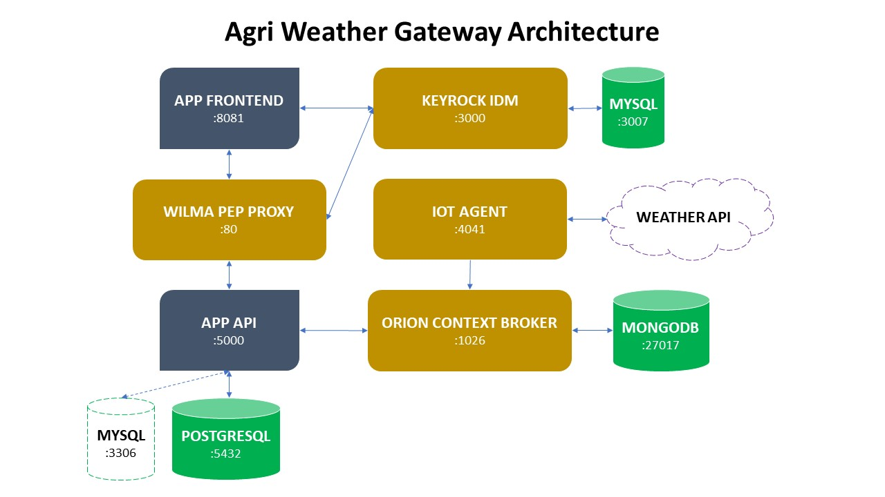

# FIWARE Agri Weather Gateway

[](https://www.fiware.org/developers)

### A first FIWARE Domain Application: Agri Weather Gateway

[](https://github.com/FIWARE/catalogue/blob/master/core/README.md)
[](https://opensource.org/licenses/AGPL-3.0)
[](https://stackoverflow.com/questions/tagged/fiware)
[](https://www.etsi.org/deliver/etsi_gs/CIM/001_099/009/01.02.01_60/gs_CIM009v010201p.pdf)
[](https://fiware-tutorials.rtfd.io)

## Table of Contents

* [Introduction](#introduction)
* [Architecture](#architecture)
* [Functionalities](#functionalities)
* [Installation](#installation)
  * [Infrastructure](#infrastructure)
  * [Services](#backend-services)
  * [Getting Started](#docker)
* [APIs](#apis)
* [Frontend](#frontend)
* [License](#license)

## Introduction

The main purpose of this project is to provide an idea of a [FIWARE](https://www.fiware.org) Domain Specific Enabler related to the [FIWARE AgriFood Reference Architecture](https://www.fiware.org/community/smart-agrifood). This DSE enables a standardized connection to many the agro-weather sensors in the market relying on [Orion Context Broker](https://fiware-orion.readthedocs.io/en/master) technology and [NGSI-LD](https://fiware-datamodels.readthedocs.io/en/latest/ngsi-ld_faq) standard. 

This product has some major interests: 

* Providing a standardized interface to several producers that can be used by AG platforms and other AG related products
* Providing a standalone platform that can be used to visualize data coming from different sensors
* Providing a product that can be used event by the government (local and central) to connect many different sensors and to provide access to the farmers

In a first market analysis this kind of product is missing and, moreover, is more than welcomed by the public administration and by platform producers to simplify the access to this kind of data. 

This idea starts from a common need expressed by two of these platforms, [Agricolus](https://www.agricolus.com/en) and [365FarmNet](https://www.365farmnet.com/en), that meet in the [IOF2020](https://www.iof2020.eu) ecosystem and recognized as a common benefit to run a joint effort to build this GE. Both the companies recognized FIWARE as the natural architecture to choose for this kind of development. 

This Gateway is both a standalone application and a data gateway for agroweather data: 

* The **standalone application**: is provided to deploy a monitoring and data collection system for government, association of farmers and other organizations that needs to collect, visualize and deliver these data to third parties. With this DSE they will be able to setup an environment capable of implement several communication standards for several hardware producers with a single point of access
* The **data gateway**: each organization will be able to deliver, upon authorization of each entity, these dynamic data to third parties, such as AG platforms and mobile apps, to enable quickly and with a reduced cost new services and functionalities

## Architecture



* **Context Providers**: 
   * Will interact with different producers ecosystems and cloud applications. Each producer may allow the access to a cloud repository or directly to the sensors. The context provider will manage the communication layers, the authentication of the weatherstations, sensors specific configurations and other hardware-related data (such as alarm notifications in case of hardware failure, if provided)
* **APIs Access for External Applications**: 
   * Upon specific authorizations third parties will be enabled to acces real time data form the DSE with given credentials
* **Web Interface**:
  * Sensors management and configuration:
     * CRUD operations on weather stations
     * Weather stations POI management
     * Specific hardware producer configuration of each weather station
  * Weather stations web map:
     * Weather stations are visualized in a web map
  * Weather stations charts and data:
     * Actual and historic data for each weather station can be accessed and visualized in a graphic format
     * Actual and historic data can be downloaded in a CSV format

## Functionalities

* Data harmonization done with NGSI-LD Data Models (updating Observed Data Model)​
* APIs for data access​
* IoT Agents to get the weather data
* Admin frontend with overall sensors dashboard​
* End user portal that will have access to data​

## Installation

#### Infrastructure

AWG is composed of some backend services, one frontend web application plus a varying number of IoT agents.

#### Services

1. [Docker](https://github.com/ging/fiware-idm)
2. [Keyrock Identity Manager](https://github.com/ging/fiware-idm)
3. [Orion-LD Context Broker](https://github.com/Fiware/context.Orion-LD)
4. [Wilma PEP Proxy](https://github.com/ging/fiware-pep-proxy)
5. [IoT Agent](https://github.com/FIWARE/tutorials.IoT-Agent)
6. [APIs](https://github.com/Agricolus/awg.api)
7. [Web Frontend](https://github.com/Agricolus/awg.frontend)

#### Getting Started

If you want to use [Docker](https://docs.docker.com/install), install it following the official guide.

If you want to use [PostgreSQL](https://www.postgresql.org/download) on premises, install it following the official guide.

To install it through Docker, type:

```sh
sudo docker run --name <my-postgres-instance-> -e POSTGRES_PASSWORD=<my-password> --restart unless-stopped -p 5432:5432 -d postgres
```

The default installation of PostgreSQL open the 5432 port.


If you want to use [Orion Context Broker](https://github.com/telefonicaid/fiware-orion) on premises, install it following the official guide.

To install it through Docker, type:
```sh
sudo docker-compose -f orion-compose.yml up -d
```

The default installation of Orion Context Broker open the 1026 port.

##### orion-compose.yml

```yml
version: "3.5"
services:
  mongo:
    restart: always
    image: mongo:3.6
    command: --nojournal
    networks:
      default:
      idmnet:

  orion:
    restart: always
    image: fiware/orion-ld
    command: -dbhost mongo
    ports:
      - "1026:1026"
    networks:
      default:
      idmnet:

networks:
  default:
  idmnet:
    name: idmnet
    internal: true
```

## IoT Agents

See [SPEC.md](https://github.com/Agricolus/AWG.iot-agents/blob/master/SPEC.md).

## APIs

See [SPEC.md](https://github.com/Agricolus/AWG.api/blob/master/SPEC.md).

## Frontend

See [SPEC.md](https://github.com/Agricolus/AWG.frontend/blob/master/SPEC.md).

## License

This project is licensed under the [AGPL License](https://www.gnu.org/licenses/agpl-3.0.en.html).